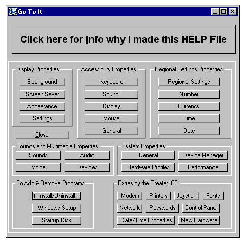



## Open It / Go To It

### Description

This is to help teach newbies how the Shell works, I Have PERSONALLY tested it on a PC with Windows XP and it worked, XP is a bit different in the codes and commands / Command Prompts,, But it does work and most of them go exactly where they are intended to go ,, some however go to the right place but on the wrong Tab ,,,,,, But still saves time and clicks to get to a location that user may want to get to,, I am still waiting for a friend who is using Windows Vista to hear how it works or worked for them

What this is, is a help file, cutting out steps in getting tp many things in a PC like getting to the ,,,, Here is all the places it will go to with just 1 click

Display Properties : Background, Screen Saver, Appearance, Settings;

Accessability Properties : Keyboard, Sound, Display, Mouse, General;

Regional Settings Properties : Regional Settings, Number Currancy, Time, Date;

Sounds and Multimedia Properties : Sound, Audio, Voice, Devises;

System Properties : General, Devise Manager, Hardware Prfiles, Performance;

Add &amp; Remove Programs : Install/Uninstall, Windows Setup, Startup Disk ;

Aso gets to the following : Modem, Printers, Joystick, Fonts, Network, Passwords, Control Panel, Date/Time Properties, New Hardware;

I originally made this progy for a freind who had somehow gotten something in their PC that blocked the access or path to the Control Panel, Every time they tried to get to the Control Panel a box popped up and said access was denied or path was wrong, What ever it was knew if someone got to the Control Panel it could be Deleted and it was like it knew it &amp; did not want to die &amp; was blocking access to the Control Panel so I made this prgy to go around it,

In the zipped file you will find, The .exe, a Notepad with the Codes for Form1 &amp; Form2, However I did not add the features of Form2 to the Notepad, those features may be added in the near future to another progy I upload, Please rate this and leave comments or help tips if you see any room for improvements or can think of any..... Thanks ICE

I call this program ,,,,,,,,,,

Open It or Go To It

I have made Updates to this now &amp; call it Advanced Go To It / Open It,,,, It will now open 15 more things on a PC with 1 simple click
 
### More Info
 

             |
---                |---
**Submitted On**   |2008-06-15 18:46:10
**By**             |[\~The\~ICE\~Man\~](https://github.com/Planet-Source-Code/PSCIndex/blob/master/ByAuthor/the-ice-man.md)
**Level**          |Beginner
**User Rating**    |4.0 (20 globes from 5 users)
**Compatibility**  |VB 6\.0
**Category**       |[Miscellaneous](https://github.com/Planet-Source-Code/PSCIndex/blob/master/ByCategory/miscellaneous__1-1.md)
**World**          |[Visual Basic](https://github.com/Planet-Source-Code/PSCIndex/blob/master/ByWorld/visual-basic.md)
**Archive File**   |[Open\_It\_\_\_2116876152008\.zip](https://github.com/Planet-Source-Code/the-ice-man-open-it-go-to-it__1-70710/archive/master.zip)

